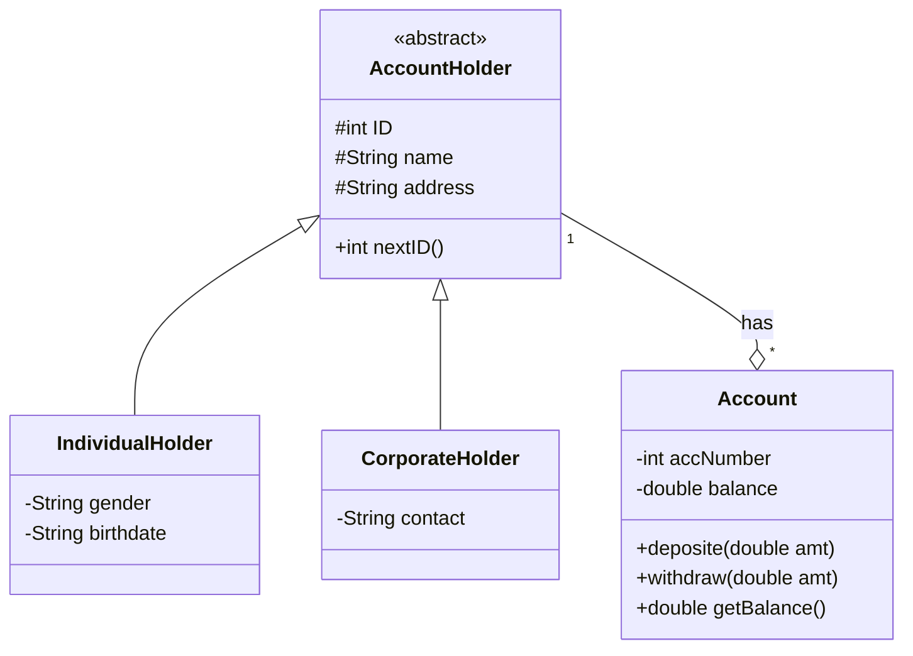
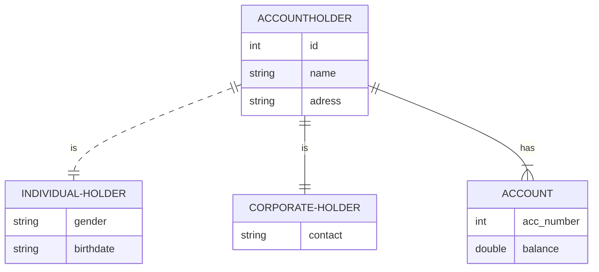

#
> M. Irfan Ardiansyah 1917051034
> Gladie Thoriqudin 1917051047
> Muhammad Weidz Alqurni 1957051012


# Account Holder System
> Sistem dapat digunakan untuk transaksi perekaman data pemegang akun di bank, dimana terdapat 2 jenis akun yaitu individual dan corporate.
> Setiap pemegang akun dapat memiliki 1 atau lebih akun.

Libraries and Tools of this project:
- mysql-connector-java-5.1.xx.jar
- sqlite-jdbc-3.xx.jar
- scene builder
- sqlite studio
- mysql server (xampp recomended)
- neatbean editor
- VS Code installed plugin
-   Markdown All in one
-   Markdown preview
-   live server

## Desain
To view the diagrams below install mermaid-diagram plugin at
### Class Diagram



### ER Diagram


### Design Class Diagram for JavaFX and Database
```mermaid
classDiagram
    AccountHolder <|-- IndividualHolder
    AccountHolder <|-- CorporateHolder
    AccountHolder "1"--o"*" Account : has
    AccountHolder o-- AccountHolderDataModel : Data Modeling
    AccountHolderDataModel <-- AccountHolderController : Data Control
    AccountHolderDataModel --> DBHelper : DB Connection
    AccountHolderController <.. AccountHolderForm : Form Control      

    class AccountHolder{
      <<abstract>>
      #IntegerProperty ID
      #StringProperty name
      #StringProperty address
      #IntegerProperty numAccounts
      
      +IntegerProperty nextID()
    }
    
    class IndividualHolder{
      -StringProperty gender
      -StringProperty birthdate
    }
    class CorporateHolder{
      -StringProperty contact
    }
    class Account{
      -DoubleProperty balance
      +deposite(double amt)
      +withdraw(double amt)
      +double getBalance()
    }

    class AccountHolderDataModel{
        Connection conn
        addAccountHolder()
        addAccount()
        getIndividualHolders()
        getCorporateHolders()
        nextAccountHolderID()
        nextAccountNumber()
    }

    class AccountHolderController{
        initialize()
        handleButtonAddAccount()
        handleButtonAddAccountHolder()
        loadDataIndividualHolder()
        loadDataCorporateHolder()
        loadDataAccount()
        handleClearForm()
    }
    class DBHelper{
        - String USERNAME
        - String PASSWORD
        - String DB
        getConnection()
        getConnection(String driver)
        createTable();
    }
