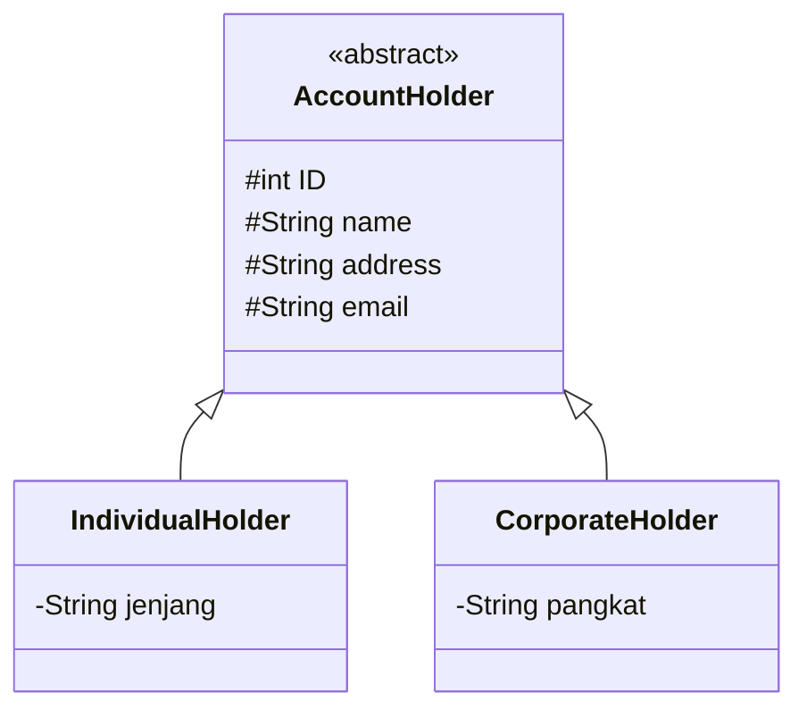
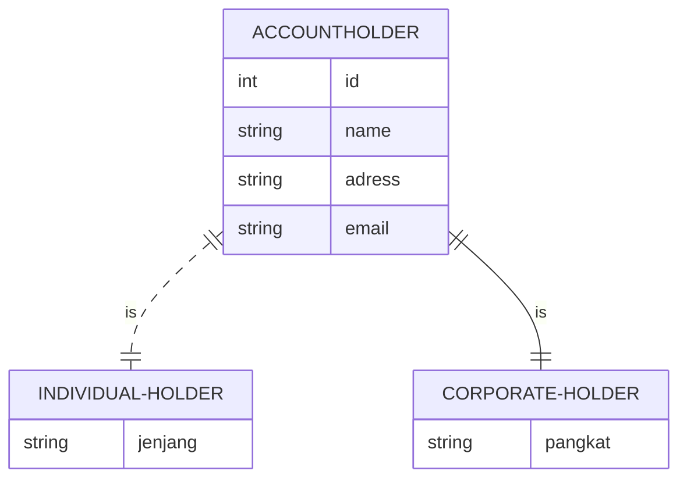

# Nama Anggota
- Muhammad Irfan Ardiansyah - 1917051034 
     - Membuat codingan program
     - Membuat desain mysql dan sqlite
     - Membuat koneksi dengan mysql dan sqlite
     
- Gladie Thoriqudin - 1917051047
     - Membuat desain gui
     - Membuat interaksi dengan controler program
     - Implementasi tabel output databse fxml
     
- Muhammad Weidz Alqurni - 1957051012
     - Membuat class diagram
     - Membuat ER diagram
     - Membuat desain class diagram untuk javaFX dan database


> Sistem ini dapat melakukan perekaman data yang menyimpan data dari murid (individual holder) dan guru (corporate holder) dalam sebuah kelas online.

Libraries dan Tools project:
- mysql-connector-java-5.1.49.jar
- sqlite-jdbc-3.340.jar
- Scene builder
- Sqlite studio
- MySQL server with xampp
- Netbeans editor
- VS code plugin
     - mermaid diagram
     - GitHub Pull Requests and Issues
## Desain
Untuk melihat diagram, install plugin mermaid-diagram di https://github.com/Redisrupt/mermaid-diagrams
### Class Diagram



### ER Diagram


### Design Class Diagram for JavaFX and Database
```mermaid
classDiagram
    AccountHolder <|-- IndividualHolder
    AccountHolder <|-- CorporateHolder
    AccountHolder o-- AccountHolderDataModel : Data Modeling
    AccountHolderDataModel <-- AccountHolderController : Data Control
    AccountHolderDataModel --> DBHelper : DB Connection
    AccountHolderController <.. AccountHolderForm : Form Control      

    class AccountHolder{
      <<abstract>>
      #IntegerProperty ID
      #StringProperty name
      #StringProperty address
      #String email
      
    }
    
    class IndividualHolder{
      -StringProperty jenjang
    }
    class CorporateHolder{
      -StringProperty pangkat
    }


    class AccountHolderDataModel{
        Connection conn
        addAccountHolder()
        addAccount()
        getIndividualHolders()
        getCorporateHolders()
    }

    class AccountHolderController{
        initialize()
        handleButtonAddAccount()
        handleButtonAddAccountHolder()
        loadDataIndividualHolder()
        loadDataCorporateHolder()
        loadDataAccount()
        handleClearForm()
    }
    class DBHelper{
        - String USERNAME
        - String PASSWORD
        - String DB
        getConnection()
        getConnection(String driver)
        createTable();
    }
